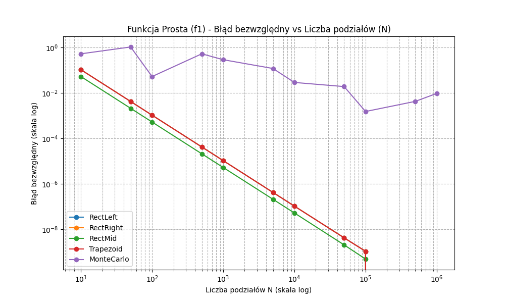
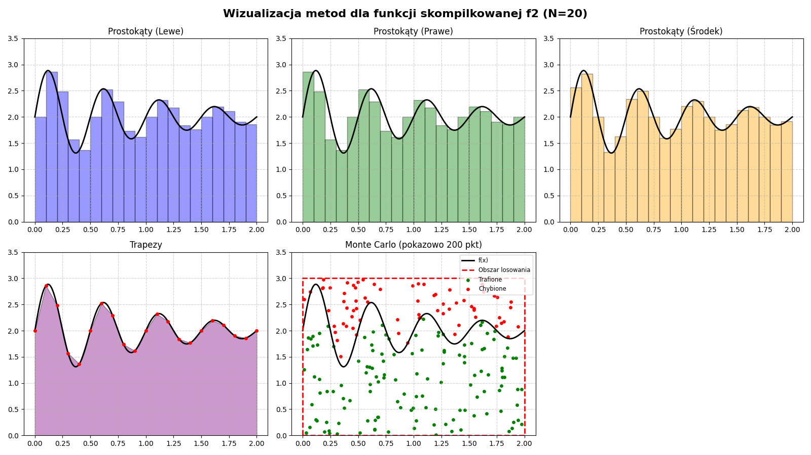
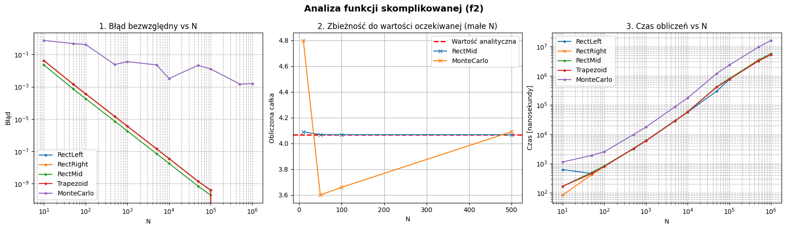

# Numerical Integration Algorithms

This is a project for the **Algorithms and Data Structures** (Algorytmy i Struktury Danych) course. It contains my C++ implementation of numerical integration algorithms, along with Python scripts to analyze and visualize the errors and performance.

## Algorithms
1. Rectangular Method (Left, Right, Midpoint)
2. Trapezoidal Rule
3. Monte Carlo Integration

## Test Functions
I tested the algorithms on two different functions:

1. **Smooth Parabola:** $f_1(x) = -x^2 + 4x$ on the interval $x \in [0, 4]$. 
   Analytical result: $32/3 \approx 10.666$
2. **Oscillating Function:** $f_2(x) = e^{-x} \sin(4\pi x) + 2$ on the interval $x \in [0, 2]$. 
   Analytical result: $\approx 4.068$

---

## Key Findings & Visualizations

### 1. The $f(a) = f(b)$ overlap
One of the most interesting things I found during data analysis is how the Left, Right, and Trapezoidal methods overlap perfectly on the error plots. 

This happens because for both of my functions, the value at the start of the interval is exactly the same as the value at the end ($f_1(0) = f_1(4) = 0$ and $f_2(0) = f_2(2) = 2$). Because of this, the math formulas for the extreme rectangular methods give the exact same result as the trapezoidal rule. They all achieve an $\mathcal{O}(1/N^2)$ convergence rate, so the red line simply hides the blue and orange ones on the plot.



### 2. Aliasing at low $N$
For the complex sine wave function, a small number of divisions (like $N=20$) is not enough to capture the shape of the wave. You can clearly see the aliasing effect below, where rectangles cut off the wave peaks. The algorithms start to converge properly only after passing $N=50$.



### 3. Execution Time & Monte Carlo
The time complexity plot shows a clear linear $\mathcal{O}(N)$ trend for all methods. The C++ engine is very fast, calculating $10^6$ divisions in a few milliseconds. 

Monte Carlo is by far the slowest method because generating random numbers using the `std::mt19937` generator takes a lot of CPU time. Also, unlike the deterministic methods that go straight down on the error plot, Monte Carlo shows random jumps (fluctuations) and is generally not very effective for 1D integrals.



---

## How to Run
1. **Compile and run the C++ engine:**
   ```bash
   g++ -O3 main.cpp -o integration_engine
   ./integration_engine

This will generate the wyniki_f1.csv and wyniki_f2.csv datasets.

2. **Run the Python visualization script:**
   ```bash
    pip install numpy pandas matplotlib
    python wykresy.py
